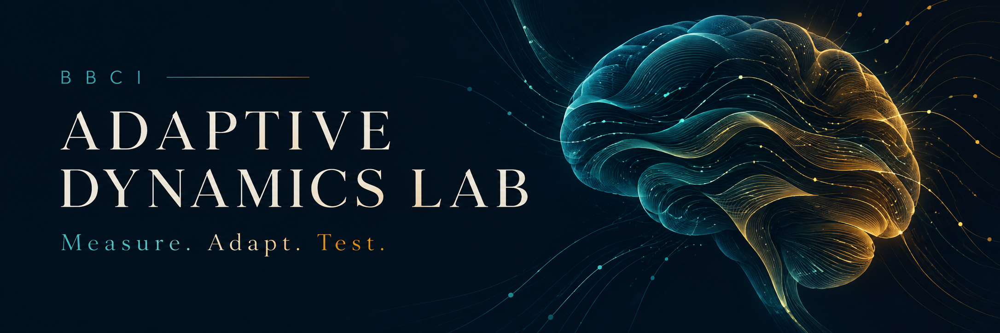
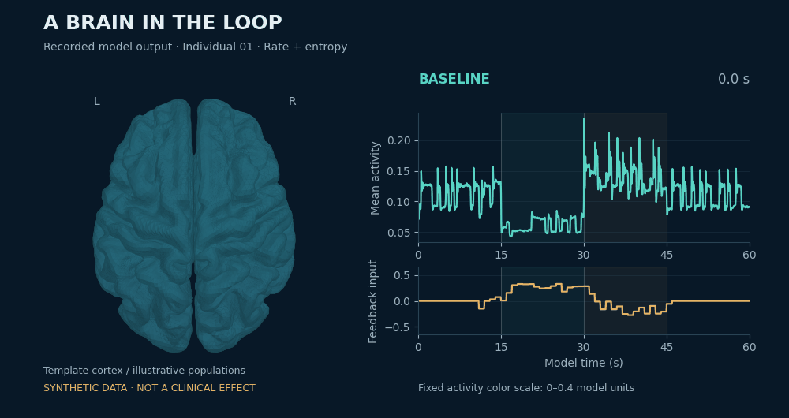

<p align="center">
  
</p>

<p align="center">
  <strong>Explore how a brain–computer interface could adapt to a changing brain.</strong><br>
  An interactive lab and reproducible research workspace for entropy-informed feedback.
</p>

<p align="center">
  <a href="#run-the-lab">Launch locally</a> ·
  <a href="artifacts/manuscript/Hopkins_Entropy_Feedback_Manuscript.pdf">Read the paper</a> ·
  <a href="research/BBCI_Research_Notebook.ipynb">Open the notebook</a> ·
  <a href="artifacts/presentations/">Explore the presentations</a> ·
  <a href="https://bbci-entropic-research-lab.ryan-hopkins.chatgpt.site">Hosted preview</a>
</p>

<p align="center">
  
  
  <a href="LICENSE"></a>
  
</p>

## A question worth testing

Brain signals change with context. Could a feedback system use both their activity and their predictability to make better adjustments—and know when its measurements stop being useful?

This project investigates that question in the context of future, person-specific autism neuromodulation research. **It is a synthetic research model, not a demonstrated therapy or a model of a diagnosed autistic person.**

<p align="center">
  
  <br><sub>Actual model output rendered on template anatomy. Illustrative populations and connections; no patient data.</sub>
</p>

## Turn the assumptions into experiments

| Explore | What you can do |
| --- | --- |
| **A brain in the loop** | Rotate the 3D cortex, inspect populations, and follow activity over time. |
| **Feedback that adapts** | Compare six strategies, from no input to rate-plus-entropy control. |
| **Conditions that matter** | Add measurement noise, delay, or an optional plasticity rule. See what breaks. |
| **Evidence you can inspect** | Trace the equations, run the Python model, and examine the recorded results. |

**24 synthetic individuals · 1,296 evaluation runs · 22 cited papers**

The central result is conditional: adding an entropy term to rate feedback improved tracking under clean measurements, but noise reversed that advantage. Task accuracy did not recover. Those limits are part of the finding—and a starting point for better experiments. [See the results →](research/RESULTS_README.md)

## Run the lab

With Git and Python 3 installed:

```bash
git clone https://github.com/ProCO-RPHopkins/BBCI-Adaptive-Dynamics-Lab.git
cd BBCI-Adaptive-Dynamics-Lab
python -m http.server 8000 --bind 127.0.0.1 --directory lab/dist
```

Open **[localhost:8000](http://localhost:8000)**. No npm installation or build step. The viewer, cortical geometry, and reference data are included. Use a browser with WebGL support.

View the [hosted preview](https://bbci-entropic-research-lab.ryan-hopkins.chatgpt.site).

<details>
<summary><strong>Run the Python benchmark or notebook</strong></summary>

From the repository root, using Python 3.12:

```bash
python -m venv .venv
source .venv/bin/activate
# Windows PowerShell: .venv\Scripts\Activate.ps1
python -m pip install -r research/requirements.txt
cd research
jupyter lab BBCI_Research_Notebook.ipynb
```

To reproduce the full study, run `python run_experiments.py`, then `python validate.py` and `python make_figures.py` from `research/`. These commands update the recorded outputs. The notebook runs its demonstration and displays the recorded aggregate study; it does not rerun all 1,296 evaluations.

See the [research guide](research/README.md) for calibration, dependencies, execution details, and limitations.

</details>

## Follow your curiosity

- **The science:** [manuscript PDF](artifacts/manuscript/Hopkins_Entropy_Feedback_Manuscript.pdf), [editable Word file](artifacts/manuscript/Hopkins_Entropy_Feedback_Manuscript.docx), and [evidence ledger](research/EVIDENCE_LEDGER.md).
- **The story:** [research explained](artifacts/presentations/BBCI_Research_Explained.pptx) and [research opportunity](artifacts/presentations/BBCI_Research_Opportunity.pptx)—both with full speaker scripts and citations.
- **The machinery:** [Python model](research/bbci/model.py), [browser source](lab/), [results and figures](research/), and [artifact authoring](authoring/).
- **The journey:** [earlier work](history/) and the [Julia prototype audit](research/ORIGINAL_MODEL_AUDIT.md).

## Help move the research forward

Useful next contributions include realistic observation models, stronger comparison controllers, independent replication, and outcome design with autistic participants. Start a [discussion in an issue](https://github.com/ProCO-RPHopkins/BBCI-Adaptive-Dynamics-Lab/issues) with a question, reproducible finding, or proposed experiment.

---

Research by **Ryan Hopkins**, with disclosed AI assistance. The manuscript is a submission draft awaiting independent review. [Cite this project](CITATION.cff) · [Provenance](PROVENANCE.md) · [Submission notes](research/SUBMISSION_NOTES.md)

Original code: **[MIT](LICENSE)**. Original research content: **[CC BY 4.0](LICENSE-CONTENT.md)**. Third-party materials retain their own terms; see [rights and attribution](RIGHTS.md).
